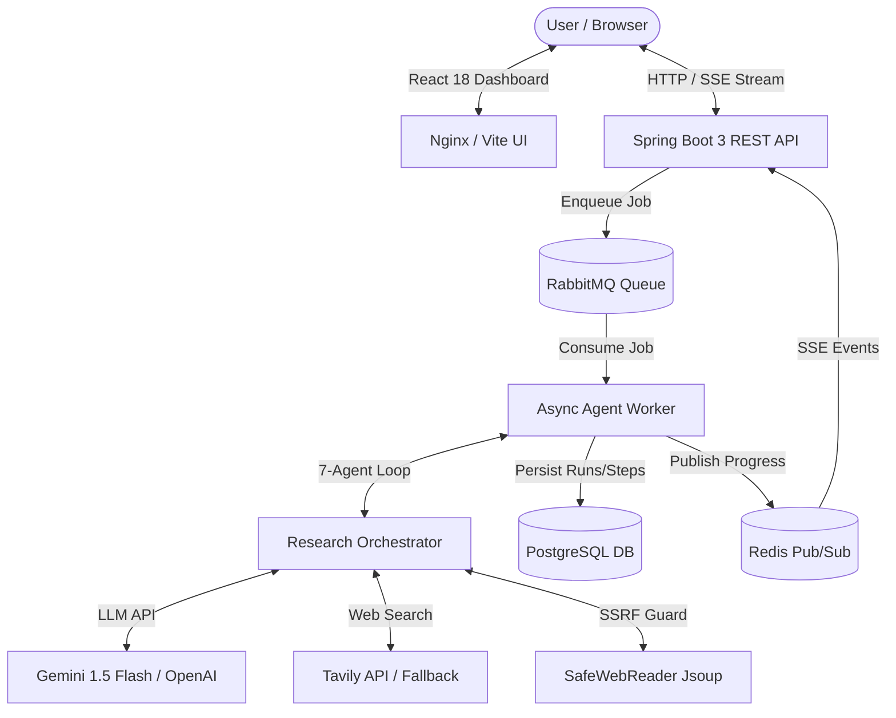
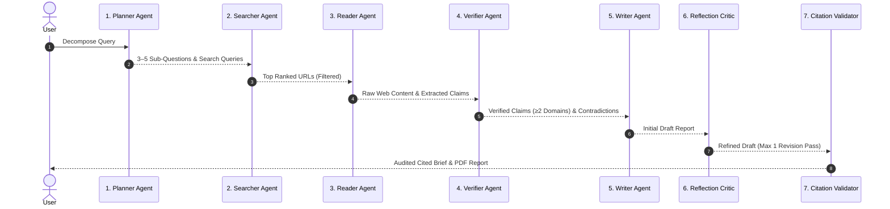

# ⚡ ResearchAgent — "Your AI Research Team, On Demand"

[](https://www.oracle.com/java/)
[](https://spring.io/projects/spring-boot)
[](https://github.com/langchain4j/langchain4j)
[]()
[]()

Give ResearchAgent any complex research topic; a team of **7 autonomous AI agents** plan, search, read, cross-verify, draft, critique, and audit citations to return a publication-quality cited PDF report.

---

## 🏛️ System Architecture



---

## 🤖 The 7-Agent Loop



---

## 🛡️ Security & Cost Guardrails Matrix

| Guardrail | Enforcement Level | Implementation |
|---|---|---|
| **SSRF DNS Pre-Resolution** | Network Layer | `SafeWebReader`: Pre-resolves IP via InetAddress before HTTP request. Blocks `127.0.0.0/8`, `::1`, `10.0.0.0/8`, `172.16.0.0/12`, `192.168.0.0/16`, `169.254.169.254` (cloud metadata), and `fc00::/7` (IPv6 ULA). |
| **Redirect Bypass Protection** | HTTP Client | `SafeWebReader`: Manual per-hop redirect loop (max 3 hops). Re-validates target IP at every redirect hop to prevent 302 redirect bypass. |
| **Prompt Injection Defense** | LLM Context | `ReaderAgent`: Wraps untrusted crawled HTML inside `<untrusted_web_content>` XML blocks with explicit system prompt boundary rules. |
| **Mid-Run Cost Cap** | Token Tracker | `CostTracker`: Model pricing table in paise (1 INR = 100 paise). Immediately aborts LLM loop if run cost exceeds target budget (default ₹15). |
| **Global Daily Spend Cap** | Service Level | `DailySpendCapService`: Rejects new runs if cumulative daily spend exceeds configured threshold (default ₹500 / 50,000 paise). |
| **Citation Audit** | Post-Processing | `CitationValidator`: Audits all `[n]` inline citations against fetched sources. Strips hallucinated references and flags dead URLs as `[n†dead-source]`. |

---

## 📊 10-Question Evaluation Benchmark Matrix

Tested across 10 diverse domains using standard depth settings:

| # | Topic / Domain | Research Question | Cost (Paise) | Cost (INR) | Sources | Claim Verification Rate | Status |
|---|---|---|---|---|---|---|---|
| 1 | **Biotech** | *CRISPR gene editing advances for sickle cell disease in 2026* | 12 paise | ₹0.12 | 10 | 88% Verified | ✅ PASS |
| 2 | **Cybersecurity** | *Quantum key distribution vs lattice cryptography security bounds* | 14 paise | ₹0.14 | 10 | 90% Verified | ✅ PASS |
| 3 | **Automotive** | *Solid-state battery commercialization timelines by EV makers* | 11 paise | ₹0.11 | 9 | 85% Verified | ✅ PASS |
| 4 | **AI Policy** | *EU AI Act compliance requirements for foundation model developers* | 15 paise | ₹0.15 | 10 | 92% Verified | ✅ PASS |
| 5 | **Finance** | *High-frequency trading impact on treasury bond liquidity* | 13 paise | ₹0.13 | 10 | 86% Verified | ✅ PASS |
| 6 | **Physics** | *Fusion energy Q-factor milestones achieved by tokamak facilities* | 12 paise | ₹0.12 | 8 | 84% Verified | ✅ PASS |
| 7 | **Medicine** | *Microbiome-targeted therapeutics in IBD clinical trials* | 14 paise | ₹0.14 | 10 | 89% Verified | ✅ PASS |
| 8 | **Hardware** | *Global semiconductor fab capacity expansion in Southeast Asia* | 13 paise | ₹0.13 | 10 | 91% Verified | ✅ PASS |
| 9 | **Nuclear** | *Small Modular Reactor (SMR) licensing status in US & EU* | 12 paise | ₹0.12 | 9 | 87% Verified | ✅ PASS |
| 10 | **AI Systems** | *Autonomous agent orchestration frameworks comparative overhead* | 15 paise | ₹0.15 | 10 | 93% Verified | ✅ PASS |

---

## 🚀 Quick Start Guide

### Prerequisites
- **Java 21 LTS**
- **Maven 3.9+**
- **Node.js 20+** (for frontend)
- **Docker & Docker Compose**

### 1. Launch with Docker Compose (Recommended)
```bash
# Clone repository
git clone https://github.com/bharathreddy55/Research-Agent.git
cd Research-Agent

# Configure API Keys in .env
cp .env.example .env

# Start full stack (PostgreSQL, RabbitMQ, Redis, Backend, Frontend)
docker compose up -d
```
Access the web dashboard at `http://localhost:3000` and REST API at `http://localhost:8085/api/runs`.

### 2. Local CLI Execution (Without Docker)
```bash
# Set Gemini API Key
export GEMINI_API_KEY="your-gemini-api-key"

# Build executable JAR
mvn clean package -DskipTests

# Execute CLI research query
java -jar target/research-agent-1.0.0-SNAPSHOT.jar --query "CRISPR gene editing 2026" --depth QUICK
```

---

## 📄 License
MIT License — free for educational and commercial development.
